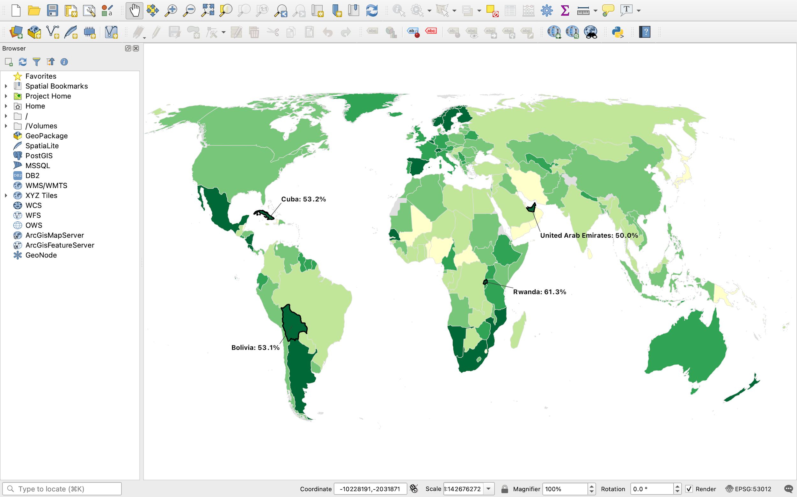

**Tutorial 1.10: Labeling and Leader Lines**

**Summary**

**Tutorial 1.10** demonstrates how to add ***labels*** to the accented countries *(Figure 1.10-1)*.

> ***Label***: map text (see **Section 2.11**)

*Figure 1.10-1: Map labels with leader lines.*

**Adding Labels**

Right click on your *UN_wom_par_fiftyplus* layer and click *Properties*, then click the *Labels* tab on the right side. 

At the top of the screen, change from *No labels* to *Single labels*. Set the *Value* to *MAPLAB*, a layer specifically designed as a label layer! 

Click *Apply*** **to view the placement of these labels. Then click *OK*.

**Editing Labels**

Change the text of each label, adding the specific percent of women in parliament to each label.

On the top of the screen go to *View→Toolbars→Label Toolbar*. If this toolbar is not checked, click on it so you can access it.

On your Toolbar toward the top of the screen, click the pencil to *Toggle Editing*.

Next, to edit the labels, click the button with abc next to a yellow pencil () to *Change Label Properties*.

Click each label, and change the *Text* to *Name: Percent*.

> * United Arab Emirates: 50.0%

> * Bolivia: 53.1%

> * Cuba: 53.2%

> * Rwanda: 61.3%

Click the pencil again to *Save Edits*.

**Using a Buffer**

Right click to open the *Properties* panel again. Initially, the labels are over the center of the country and hard to read. One way to make labels clearer to read is a buffer. 

In the *Labels* tab, click *Buffer*, then check the box that says *Draw text buffer*. Click *Apply* to see these labels. 

The buffer certainly makes our labels easier to read. However, you are labeling small countries, like Rwanda. Our label covers up the entire country! Buffers may be a good option for a future map where you need to label larger countries. This map will need a different approach.

Uncheck the *Draw text buffer* box. Switch from *Buffer* to *Callouts*. 

**Using a Leader Line**

Check the *Draw callouts* box. Click *OK*. Nothing has changed yet. To position the labels where you want them, manually drag them.

In the Label Toolbar, find the *Move Label or Diagram* option, which looks like the letters abc next to an arrow (). Click on this option, and then click on a label.

A popup asks you to *Choose Primary Key*. Select *MAPLAB* and click *OK*.

Your first click selects the label. Then you can move your mouse to change the position of the label. A second click places the label. Move each label into the ocean. A callout line will follow the label, drawing your reader's attention to each country.

Finally, increase the size of the text. In *Properties→Labels* click on the *Text* tab. Change the *Style* to*** **Bold* and the *Size* to *12.0*, then click *Apply*. Click *OK* if you like this style, or continue changing the text until you are satisfied. 

Now you have labeled the accented countries with leader lines. Save and proceed to **Tutorial 1.11**: Adding Elements to Layout View.

