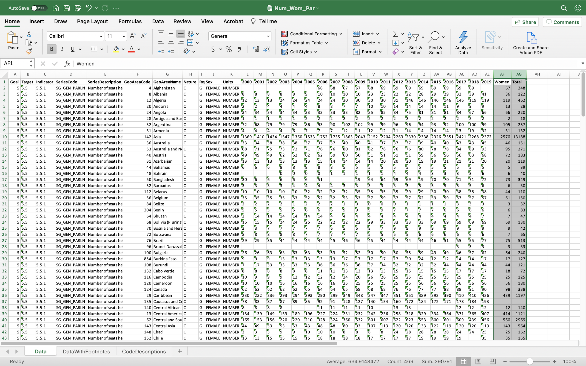
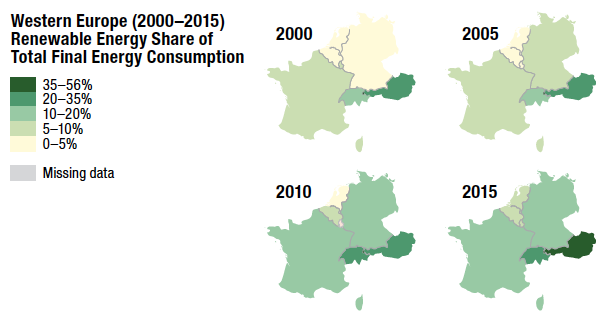

**Tutorial 1.4: Cleaning Attribute Data**

**Summary**

**Tutorial 1.4** demonstrates how to "clean" the downloaded datasets. In this case, cleaning refers to preparatory steps needed to edit datasets collected from multiple sources so that they can be combined in mapping software. Data cleaning also can include checking for errors, eliminating unnecessary fields, and so on.

**Renaming Datasets**

Open *SG_GEN_PARLN.xlsx* (number of women in parliament) and *SG_GEN_PARLNT.xlsx* (total members of parliament).

Rename these files to something easier to understand. Click *File,* then *Save As...* for *SG_GEN_PARL.xlsx* and name it *Num_Wom_Par.xlsx (Figure 1.4-1)*.

*Figure 1.4-1: Excel spreadsheet of edited data for choropleth map.*

Repeat this process for *SG_GEN_PARLNT.xlsx* and name it *Num_Tot_Par.xlsx*.

You created copies of the original files because you are going to edit the new files. Preserving the original file for future use is good data management practice.

**Converting to Qualitative Numbers**

Select the entire *2020* column in *Num_Wom_Par.xlsx* by clicking the header. A yellow triangle with a *!* pops up. The data is *Number Stored as Text*, which is interpreted by mapping software as nominal-level or qualitative data. However, choropleth maps require ordinal-level or ***quantitative*** (interval or ratio) data.

> ***Quantitative data***: interval- and ratio-level data together (see **Section 1.4**)

> ***Ratio level data***: attribute data that is quantitative values with a fixed zero

> ***Interval-level data***: attribute data that is quantitative, but the zero value is arbitrary and, thus, limits estimation of relative magnitudes

Click *Convert to Number* to enable QGIS to interpret the attribute as quantitative. The attributes also need to be converted to numbers for other ***data transformations***, such as normalization and classification.

> ***Data transformation***: statistical conversion of an attribute (see **Section 1.7**)

**Combining Attribute Datasets**

Complete several optional cleaning steps for clarity when combining attribute columns from multiple datasets.

Rename the *2020* column in *Num_Wom_Par.xlsx* as *Women*. You will only copy the data from 2020 given the subject of the choropleth map, see **Tutorial 1.1**. 

Open *Num_Tot_Par.xlsx*. Find the *2020* column in this table. Like before, convert the data from qualitative text to quantitative numbers.

Select the entire *2020* column in *Num_Tot_Par.xlsx* by clicking the header and *Copy* it. Open your *Num_Wom_Par.xlsx* spreadsheet and right click on the column to the right of your *Women* column to paste this column. Rename the copied *2020* column *Total*.

Check to make sure the data copied properly. Scroll to the bottom of the data and verify each column has the same number of rows. Luckily, the United Nations has a very tidy database for the SDG indicators, providing a row for each country even when the data are missing or unreported, thus making the rows the same across all downloaded datasets. However, if you download data from other sources in the future, this process might not be so simple. Further, if you sorted the data by a column header for any reason, you will need to do so for both files in order to copy a column from one dataset into another dataset.

You have a lot of other columns in your table. You do not need to convert them to a number because you will not be using them in this project and even can delete them altogether. Because you made a copy of your originally downloaded files, you still have access to the additional years if you later revise your plan to map temporal data (*Figure 1.4-2, *see **Section 3.9**).

*Figure 1.4-2: Temporal data visualization, book Figure 3.9-1.*

**Converting to CSV**

Save the file again using your project folder. QGIS will not read the Excel file format, so save the data as a Comma Separated Value (CSV) file. Click *File→Save as…* and name the file *unwp.csv*. Switch the File Format to *CSV UTF-8 (Comma delimited) (.csv)*** **and click *Save*. 

Because this document has multiple spreadsheets, you will receive a minor error message. You can only save one spreadsheet at a time as a .csv file. You only need the sheet you have been working on, so click *OK*.

Also save the County Code file in the .csv format. Open *Comtrade Country Code and ISO list.xlsx*. Luckily, you do not need to reformat anything on this spreadsheet. Repeat the steps above, naming this file *cc*.*csv*.

Now that your data is cleaned, proceed to **Tutorial 1.5**: Creating a Project and Setting the Projection.

