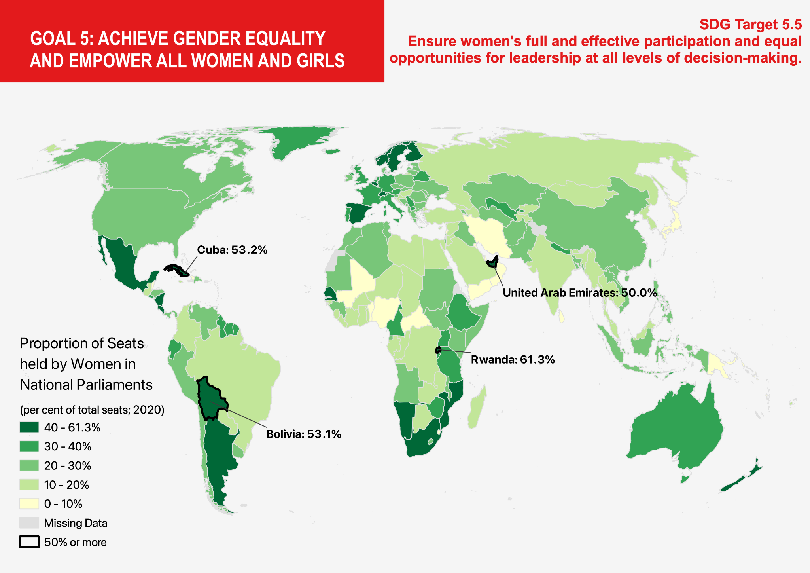

## Tutorial 1.12: Exporting the Map

**Summary**

**Tutorial 1.12** demonstrates how to export the map *(Figure 1.12-1)*. 

###### Figure 1.12-1: Exported image of choropleth map.

**Types of File Formats**

To the right of the printer icon, there are three options.

First, you can *Export as image* (), such as a PNG, a JPG, or a TIFF. Use PNG if you intend to display the image on the web. Use JPG and TIFF for print.

Second, you can *Export as SVG* (). If you intend to further edit your map in Inkscape (an open source design program), Adobe Illustrator, or another graphic design program, SVG is the best choice.

Third, and most common, you can *Export as PDF* (). PDFs work well for screen and print, as long as you will not be further editing your map.

**Exporting the Map**

For practice with this project, export as a PDF. However, when making maps in the future, the person or organization that you are working for will likely tell you which format they prefer.

You have now learned how to export your map. If you would like to add additional stylistic features, proceed to [**Tutorial 1.13**: Advanced Layout Styling](/1_Choropleth/1.13_Advanced_Layout.md).

