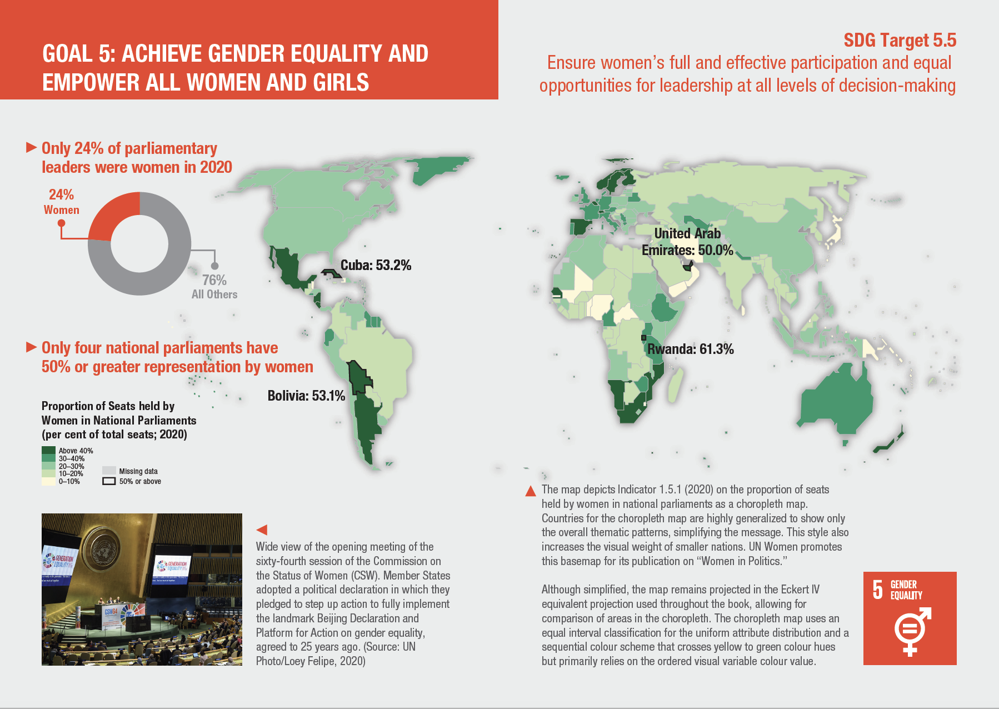
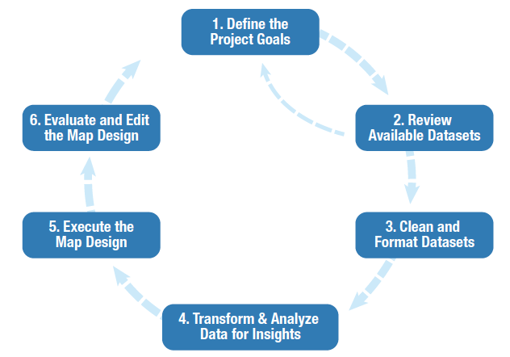
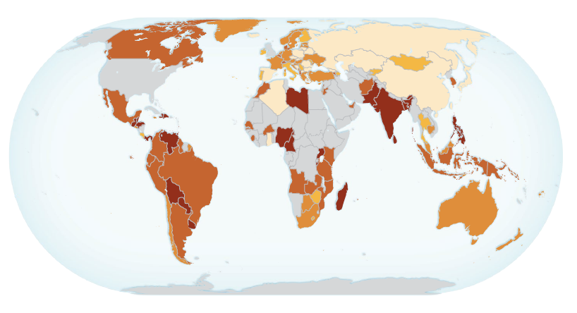
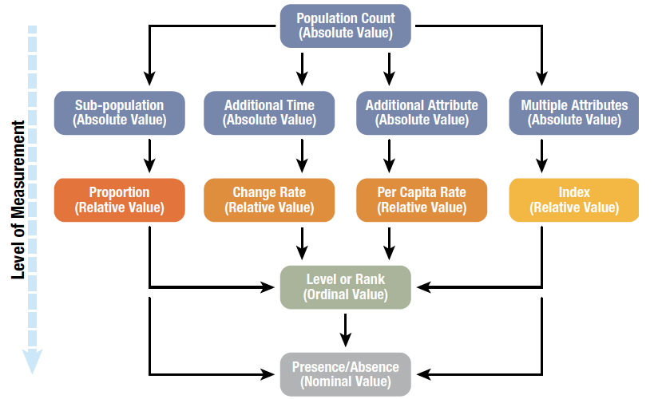
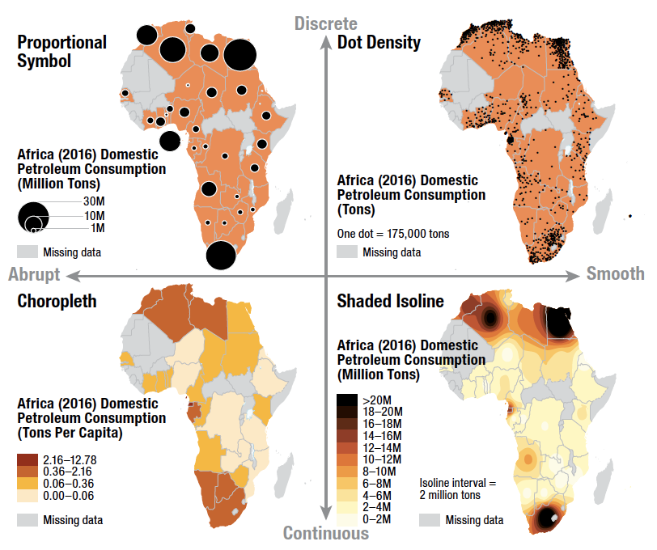
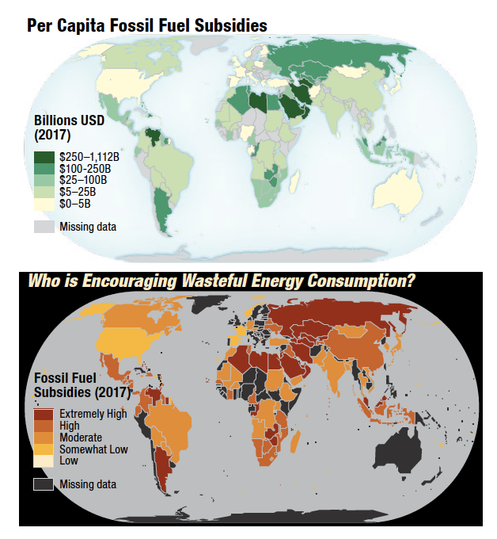

## Tutorial 1.1: Overview and Project Planning

**Summary**

**Tutorial 1.1** demonstrates how to design the ***choropleth map*** on page 34, which displays ***SDG*** Target 5.5.1: "Ensure women's full and effective participation and equal opportunities for leadership at all levels of decision-making" (*Figure 1.1-1*).

> ***Choropleth map***: a thematic map that shades enumeration units by their attribute values, primarily relying on colour value (see **Section 3.3**)

> ***Sustainable Development Goals (SDGs)***: the overarching blueprint to achieve a better and more sustainable future for all and to address global challenges, adopted in 2015 by the Member States of the United Nations (SDGs, see **Section 1.1**).

###### Figure 1.1-1: Final Choropleth map of SDG 5.5, from page 34 of Mapping for a Sustainable World.

Before starting any map design, it is important to plan your project. **Tutorial 1.1** follows the six steps outlined in **Section 2.2**: Project Planning & the Cartographic Design Process of the *Mapping for a Sustainable World* book (*Figure 1.1-2*).

###### Figure 1.1-2: The cartographic design process, book Figure 2.2-1.

**1. Define the Project Goals**

Your design goal in the first set of tutorials is to create a map titled "Goal 5: Achieve Gender Equality and Empower All Women and Girls". This map is intended for a general audience.

Your pedagogical goal in completing these tutorials is to learn the basics of QGIS to create a choropleth map (*Figure 1.1-3*, see **Section 3.3**). These tutorials will reference many sections of *Mapping for a Sustainable World* to learn about the map creation process.

###### Figure 1.1-3: Choropleth map, book Figure 3.3-1.

Within these broader goals, define the map ***subject***, ***purpose***, ***audience***, and use ***environment***. The subject is the proportion of seats held by women in national parliaments as a percent of total seats in 2020. The purpose, while a learning opportunity in these tutorials, generally is to advocate for gender equity. This map is intended for a general audience and all maps described in these tutorials are designed for a print medium.

> ***Subject***: the who, what, when, and where, or the spatiotemporal context, for the map (see **Section 2.1**)

> ***Purpose***: the overall goal in producing the map (see **Section 2.1**)

> ***Audience***: the intended users of the map (see **Section 2.1** and **Section 4.1**)

> ***Environment***: the medium on and setting in which the map is used (see **Section 2.1**)

**2. Review Available Datasets**

Indicator 5.5.1 includes ***location***, ***attribute***, and ***temporal*** data. Specifically, this tutorial maps Indicator 5.5.1 by country for 2020 using the ***ratio level data*** available through the SDG page of the [UN Statistics Portal](https://unstats.un.org/sdgs/indicators/database/)) (*Figure 1.1-4*). Review this data for now; do not download it yet; that step is part of [**Tutorial 1.3**](/1_Choropleth/1.3_Download_Data.md).

> ***Location***: the where of geospatial data (see **Section 1.2**)

> ***Attribute***: the what or who of geospatial data (see **Section 1.3**)

> ***Temporal***: the when of geospatial data (see **Section 1.4**)

> ***Ratio level data***: attribute data that is quantitative values with a fixed zero (see **Section 1.4**)

###### Figure 1.1-4: Types of attribute data, book Figure 1.7-1.

Because Indicator 5.5.1 is an ***absolute attribute***, you will ***normalize*** the data into a proportion before mapping as a choropleth map. Normalizing as a proportion of percentage of women in parliament standardizes the data to account for variable membership size across national parliaments.

> ***Absolute Attribute***: an attribute measured or counted and reported without consideration of other attributes (see **Section 1.4**)

> ***Normalization***: the conversion of absolute attributes to relative attributes to mask privacy of individual-level data and to ensure visual comparability of enumerated data across enumeration units of varying arrangement, shape, and size (see **Section 1.4**)

**3. Clean and Reformat Data**

In [**Tutorial 1.4**](/1_Choropleth/1.4_Clean_Data.md), you will clean and combine the location and attribute data. Cleaning and reformatting data can be one of the most time-consuming parts of the map creation process. The United Nations makes their SDG indicator datasets relatively easy to map with little modification, but if you create a map in the future with data from another source, you may have to spend much more time cleaning the data (see [**Tutorial 4.1**](/4_Future_Directions/4.1_Recommendations_own_data.md) if you are mapping a different dataset from the Indicator 5.5.1 example).

**4. Transform and Analyze the Data for Insights**

After cleaning the data, you will transform and analyze the attribute dataset for insights. As indicated in Step 2, the primary attribute transformation will be normalizing Indicator 5.5.1 into a percentage. You then will join this attribute data to the UNMAP NAME location data to enable preliminary maps and diagrams of the attribute distribution.

Cartographers use many methods to symbolize data (see **Section 2.9**) for many ***thematic map*** types (*Figure 1.1-5*). Early exploration and analysis often includes generating a range of preliminary map designs. **Tutorials 1.1-1.13** do much of this preparatory work for you as you learn map design in QGIS, but return to this exploratory step as you make additional maps.

> ***Thematic map***: a map that depicts the variation of one or sometimes several geographic phenomena (see **Section 3.1**)

###### Figure 1.1-5: Thematic map types, textbook Figure 3.1-1.

**5. Execute the Map Design**

In this step, you apply the range of design decisions determined in prior planning steps. You also will add ***stylistic*** elements to match the map subject and purpose (*Figure 1.1-6*)*.* By adding, removing, or accenting elements, you will make the map easier to read. 

> ***Visual style***: a cohesive set of design characteristics and qualities that reinforce the purpose of the map (see **Section 2.14**)

###### Figure 1.1-6: Visual art and visual style, book Figure 2.14-2.

**6. Evaluate and Edit the Map Design**

Always check your map for errors after completing a draft design. This is especially important when you have gathered the data yourself.

When you are making your own map in the future, review **Sections 2.1**, **2.2**, and **2.3** of the *Mapping for a Sustainable World* book to assist your planning process. While many of these steps are done for you in this tutorial, they are vital to the production of your own design.

Proceed to [**Tutorial 1.2**: Downloading QGIS](/1_Choropleth/1.2_Download_QGIS.md).

