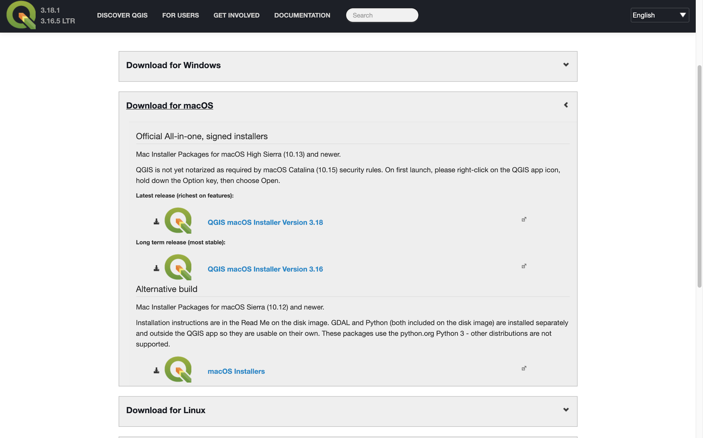
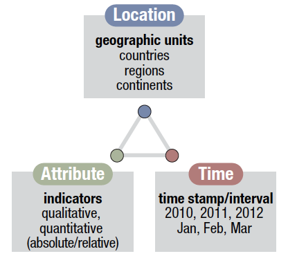

## Tutorial 1.2: Downloading QGIS

**Summary**

**Tutorial 1.2** demonstrates how to download the correct software, QGIS, for this project (*Figure 1.2-1)*.

###### Figure 1.2-1: Download screen for QGIS.

**About QGIS**

QGIS is GIS software that is open access and free to download and use (see **Section 4.13**). ***Geospatial data*** is a unique type of data that requires special mapping software to manipulate (*Figure 1.2-2*).

> ***Geospatial data***: data describing aspects of the natural and built environments with the components of location, attribute(s), and time (see **Section 1.2**)

###### Figure 1.2-2: Elements of geospatial data, book Figure 1.2-1

Because the QGIS software is maintained by volunteers, it often has more glitches than proprietary software. While most users encounter few issues, it is a good idea to save often, in case the software crashes.

**QGIS Download**

[*Download QGIS*](https://qgis.org/en/site/forusers/download.html) for Windows, Mac, or Linux. On the linked page, scroll to your computer type and download the software. Download the version listed as "most stable" rather than the "latest release".

Follow the instructions prompted by the install package.

These tutorials also use Microsoft Excel to manipulate attribute data. Google Sheets, spreadsheet software available on a "fremium" model with costs associated only on expanded data use, also can be used for attribute data.

You have now downloaded QGIS to your computer. Remember to keep it up to date for use in future projects. Proceed to [**Tutorial 1.3**: Downloading Location and Attribute Data](/1_Choropleth/1.3_Download_Data.md).

