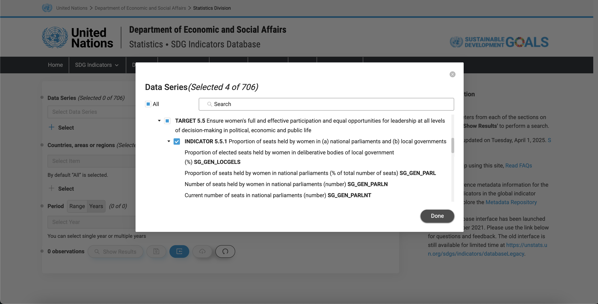

## Tutorial 1.3: Downloading Location and Attribute Data

**Summary**

**Tutorial 1.3** demonstrates how to download ***attribute*** and ***location data*** to make your choropleth map (*Figure 1.3-1)*. You will download two files:

1. Shapefile or geodatabase of countries in the world
2. Proportion of seats held by women in national parliaments

Maps often compile data from many sources, often in incomplete or messy forms. It is your job to "clean up" the data so that it can be used harmoniously in a map.

> ***Location***: the where of geospatial data (see **Section 1.2**)

> ***Attribute***: the what or who of geospatial data (see **Section 1.3**)

###### Figure 1.3-1: SDG data from the UN website.

**Downloading Location Data**

First, create a folder to store the project and data. In your preferred location on your computer, create a folder called *SDG_choropleth_tutorial*.

This tutorial demonstrates how to download a Geodatabase with a world countries shapefile (.shp) directly from the UN. Downloading a Geodatabase takes a few extra cleaning steps, so if you would like to start with an already cleaned shapefile (allowing you to move right into mapping) you may download it [here](https://github.com/uwcartlab/Vienna-DC-2025/tree/main/Data/Spatial-Data).

Download [the Geodatabase](https://geoportal.un.org/arcgis/apps/sites/#/geohub/datasets/33e5c17e2de94a75ae7fdb9395cd277f/about) from the UN Geospatial Hub by clicking the "Download" button. At its simplest, geospatial data are stored as a shapefile (extension .shp), a common format created by Esri recognized by most mapping software. Shapefiles actually are a combination of many files when viewed in a file folder. However, these are previewed and mapped as just a single file in mapping software like QGIS. Thus, it is recommended to rename, edit, join, etc., shapefiles in mapping software and not elsewhere to avoid corrupting the file.

Save the file in your project folder. Unzip the file to access its contents. If you do not have a program that can zip and unzip (sometimes called "compress" and "uncompress") zip files, download the open source *[7zip](https://www.7-zip.org/download.html)* program to do so. The folder will contain a large number of files that are unreadable on their own, so we will need to use GIS software to access them. We will open the files in [**Tutorial 1.5**](/1_Choropleth/1.5_Project_and_Save.md).

**Downloading Attribute Data**

Download the data for SDG indicator 5.5.1 from the [Statistics Division of the UN website](https://unstats.un.org/sdgs/dataportal/database). This database stores the data for all SDG indicators. 

Under *Data Series* click the plus sign next to *Select* to expand *Goal 5→Target 5.5→Indicator 5.5.1*.

Click the box next to *INDICATOR 5.5.1: Proportion of seats held by women*. Then, click "Done".

Do not select anything for *Countries, areas, or regions*.

Under *Period* click *Range* and select *2020* as both the start year and end year. This tutorial reproduces the graphics from the book and thus uses the year 2020, but you are welcome to select a more recent year.

Click *Show Results* (bottom of the page) to preview the data. ***Do not*** click the dark grey *Download* button. 

Scroll down and expand the third result, *SG_GEN_PARL* and click *Download XLS* (bottom of the page)Save this file in your project folder.

Here, you are downloading the percentage of seats in parliament held by women, not just the number of seats held by women, which supports supports ***normalization***.

> ***Normalization***: the conversion of absolute attributes to relative attributes to mask privacy of individual-level data and to ensure visual comparability of enumerated data across enumeration units of varying arrangement, shape, and size (see **Section 1.4**)

Now you have saved the necessary attribute and locational data to make your choropleth map. Proceed to [**Tutorial 1.4**: Cleaning Attribute Data](/1_Choropleth/1.4_Clean_Data.md).

