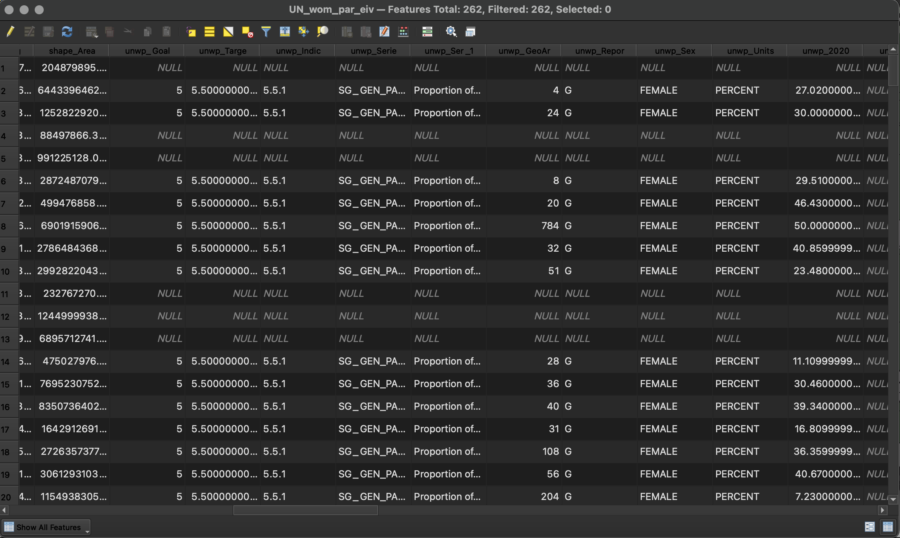

## Tutorial 1.6: Adding and Joining Attribute Data

**Summary**

**Tutorial 1.6** demonstrates how to add attribute data to the project and join layers *(Figure 1.6-1)*.

###### Figure 1.6-1: Attribute table for joined layers.

**Adding CSV Files**

In the Menu bar, click *Layer→Add Layer→Add Delimited Text Layer*. Click the three dots and add *unwp.csv* to the project. Do not change any settings. Click *Add* and close the window.

Check if the data imported properly. Right click *unwp* in the *Layers* panel and click *Open Attribute Table*. View the data to make sure you do not see any issues. Close the tab.

Since this is a CSV file, nothing new appears on the screen. It only contains attribute data, not location data.

**Joining SHP and CSV Files**

Right click on *UN_Countries_GDB-BNDA_simplified* in the *Layers* panel and click *Properties*. Click the *Joins* tab.

Click the green plus sign (). Join the data in this file to your csv *unwp*.

The *Join layer* should be your *unwp* file. 

Find a field that is the same between the two files. The computer will only make a join when the data in the two fields is exactly the same. Use the country names to join the data.

The *Join field* is the header of a field in the CSV file. The *Join field* is called *GeoAreaCode* and the *Target field* is called *M49 Codes*. 

Click *OK* and then click *OK* again.

Open the Attribute Table for *UN_Countries_GDB-BNDA_simplified*. View the data to see if it has been joined correctly. Scroll to the middle to find the field *unwp_2020*. If some rows are NULL, that is okay. These are usually countries where there is no data. If all countries are NULL, there was an issue with your *Join*. If there is an issue, remove the join and try again. (Note: most of the columns on the right are null for this dataset).

If you notice countries disappear - this means that there were countries that could not be joined. The problem could be that the M49 attribute is set as a string instead of a number. This needs to be fixed. To do this in QGIS - highlight the UN country polygon file data in the table of contents or layer pane. In the top menu - Click *Processing* then select *Toolbox* then find the *Refactor fields* tool to change the data type for M49 codes from string to integer and click run.   

Now right click the layer and save as a new name and save as a shapefile. 

Next, do the join layer steps again. 

Once you have the file that looks correct save your work.

Save *UN_Countries_GDB-BNDA_simplified* as a new file. You have only created a temporary join. Right click *UN_Countries_GDB-BNDA_simplified* in the *Layers* panel and click *Export→Save features as…*

Click the three dots and name your file *UN_wom_par_eiv.shp*. Confirm *Add saved file to the map* is selected and click *OK*. 

Remove all layers except for *UN_wom_par_eiv*. Right click each file and click *Remove Layer…* and then *OK*. 

Now you have added all the necessary layers and joined them together. Save and proceed to [**Tutorial 1.7**: Editing the Attribute Table](/1_Choropleth/1.7_Edit_Attribute_table_Map_Algebra.md).

