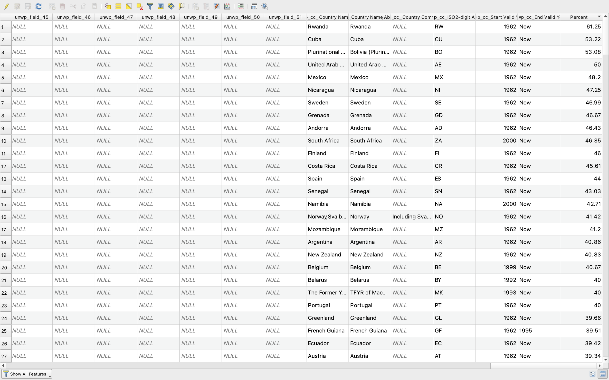
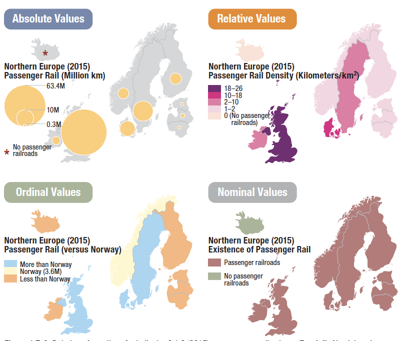
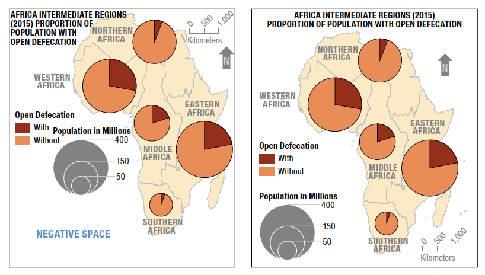

## Tutorial 1.7: Editing the Attribute Table

**Summary**

**Tutorial 1.7** demonstrates how to normalize the data (*Figure 1.7-1)*. 

###### Figure 1.7-1: Percent column in the attribute table.

**Introduction to Normalizing Data**

In this step you will ***normalize*** the number of women in parliament by total members of parliament. You can read more about normalizing data in **Section 1.7** *(Figure 1.7-2)*. 

> ***Normalization***: the conversion of absolute attributes to relative attributes to mask privacy of individual-level data and to ensure visual comparability of enumerated data across enumeration units of varying arrangement, shape, and size (see **Section 1.4)**

###### Figure 1.7-2: Data transformation, book Figure 1.7-2.

You are designing a choropleth map. Choropleth maps exacerbate the ***Modifiable Areal Unit Problem*** (*Figure 1.7-3*). 

> ***Modifiable areal unit problem (MAUP)***: a mapping issue in which the same individual-level data when enumerated to different sets of polygonal boundaries results in different visual patterns in the map (see **Section 1.8)**

###### Figure 1.7-3: The Modifiable Areal Unit Problem, book Figure 1.8-1.

You can never eliminate this problem. However, you can decrease the error by dividing the number of women in parliament by the total number of members of parliament. 

**Normalizing Data in the Attribute Table**

Right click on *UN_wom_par_eiv* in the *Layers* panel. Click *Open Attribute Table*.

Enter editing mode by clicking on the pencil () to *Toggle editing mode*. 

Above the data, click on the *Field Calculator* (). It is the fourth icon from the right. Create a new field (column). 

Name the *Output field name* as *Percent*.

Change the *Output field type* to *Decimal number (real)*.

Change the *Output field length* to *6* and the *Precision* to *2*.

Write the expression. Type *(*. To the right of the box expand *Fields and Values* and double click on *unwpcc_Wom* to add it to the expression. 

Type  */*, then add *unwpcc_Tot* from the box on the right. Add *)*.

Finally, type **100* in the box. Click *OK*.

Scroll all the way to the right of the attribute table to see the column.

Click the pencil in the upper left of the attribute table again to exit editing mode. When a popup window appears asking if you want to save your changes, click *Save*.

**Deleting Antarctica to Improve Layout**

Delete Antarctica from the map. Most world maps include Anatarctia, but it can be removed in some instances to save space on the page, improving the ***layout*** (*Figure 1.7-4*).

> ***Layout***: the placement of map elements on the map page or screen (see **Section 2.13**)

###### Figure 1.7-4: Layout considerations, book Figure 2.13-1.

With the attribute table still open, click on the pencil to enter editing mode again. Toggle back and forth between editing mode in order to save your changes in small steps, rather than all at once, in case something goes wrong.

Find Antarctica in the attribute table. Sort alphabetically by the *MAPLAB* column. Click the heading of the column to sort so countries that start with *A* appear at the top.

Click on the number next to the row for Antarctica. Click red trash can () to *Delete selected features*. Click the pencil to save your edits.

Close the attribute table.

Your data is now in a normalized format. Save and proceed to [**Tutorial 1.8**: Classifying Attribute Data](/1_Choropleth/1.8_Classify_Data.md).

