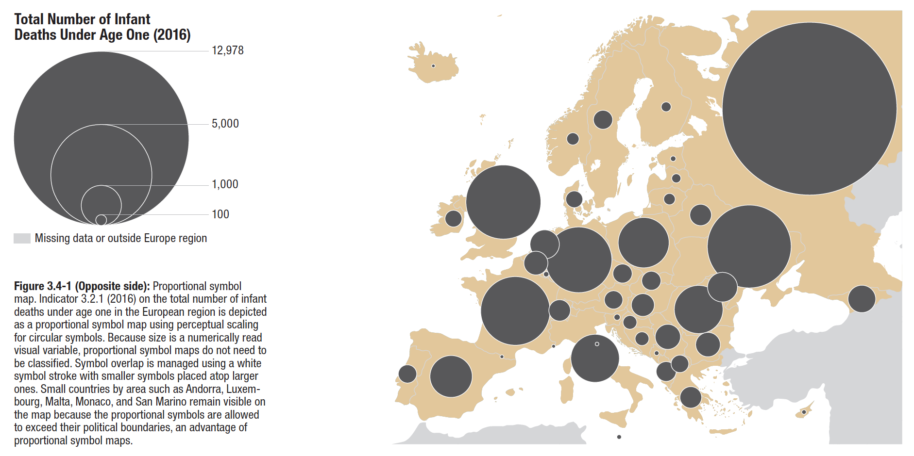

**Tutorial 2.1: Overview and Setup**

**Summary**

**Tutorial 2.1** demonstrates how to make the ***proportional symbol map*** on page 65, which displays SDG Target 3.2.1: "By 2030, end preventable deaths of newborns and children under 5 years of age, with all countries aiming to reduce neonatal mortality to at least as low as 12 per 1,000 live births and under-5 mortality to at least as low as 25 per 1,000 live births" *(Figure 2.1-1)*.

This is the second in a set of tutorials paired with *Mapping for a Sustainable World*. The first tutorial teaches you how to create a choropleth map. Completion of the previous tutorial is not required to complete the proportional symbol map tutorial. However, the choropleth tutorial is a specific, step-by-step tutorial. The proportional symbol map tutorial is less specific and asks you to refer to the previous tutorial for a "how to", rather than describing each step in absolute detail.

> ***Proportional symbol map***: a thematic map that uses the visual variable size to scale

> point symbols by their attribute values (see **Section 3.4**)

*Figure 2.1-1: Proportional symbol map of SDG 3.2.1, from page 65 of* Mapping for a Sustainable World.

**Tutorial 2.1** covers the same instructions as **Tutorials 1.1** through **1.4**

**Scope**

Before beginning the map creation process, always consider the scope of your project. This includes: 

> * Define the Project Goals

> * Review Available Datasets

> * Clean and Reformat Data

> * Transform and Analyze the Data for Insights

> * Execute the Map Design

> * Evaluate and Edit the Map Design

Refer to **Tutorial 1.1** of the tutorial or **Section 2.2** of the *Mapping for a Sustainable World* book for more detail.

**Download QGIS**

If this is your first time using QGIS, refer to **Tutorial 1.2** to download it.

**Download Location and Attribute Data**

On your computer, create a project folder called *SDG_proportional_tutorial*. 

Follow **Tutorial 1.3** to download the data. Every step is the same, except this time you will be downloading SDG Indicator 3.2.1 *Infant deaths (number)*. Because proportional symbol maps rely on symbols rather than geographic area, they do not need to be normalized like choropleth maps.

**Clean Attribute Data**

Resave the *SH_DYN_IMRTN.xlsx* file as *Tot_Inf_Mor.xlsx*. Open the new file and convert the 2019 column to numeric. Use the 2019 data because it is the most recent data for this metric.

Export this file as a CSV called *unid.csv* and export *Comtrade Country Code and ISO list.xlsx* as a CSV called *cc.csv*.

Refer to **Tutorial 1.4** for more detail on how to complete these steps.

Save and proceed to **Tutorial 2.2**: Projecting Map and Adding Data.

