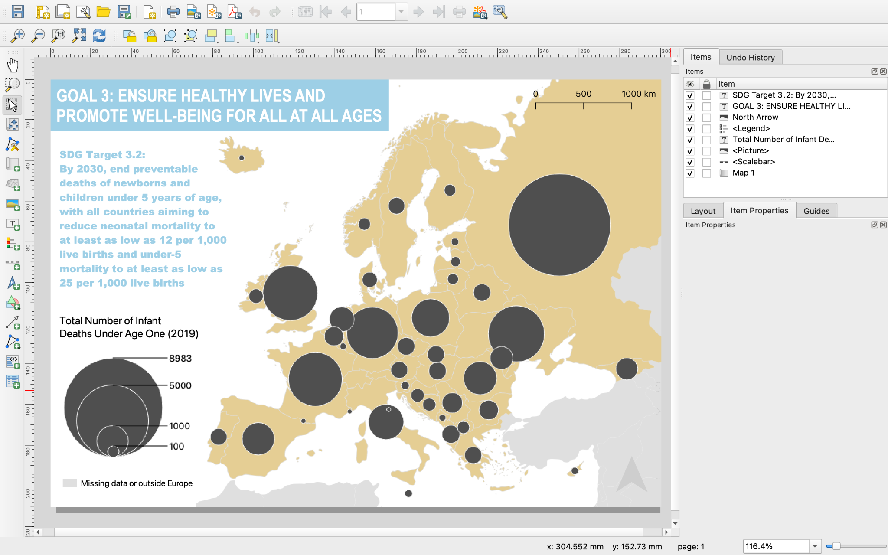

**Tutorial 2.7: Advanced Layout Styling**

**Summary**

**Tutorial 2.7** demonstrates how to style your map in the print layout *(Figure 2.7-1)*.

*Figure 2.7-1: Final layout of proportional symbol map*

**Adding Map and Text to the Print Layout**

Create a new print layout and name it *UN_inf_mor_final*.

Draw a box for the map on the right ¾ of the layout. This will make a shape that is somewhat square, like in the book, rather than rectangular.

Set the *Scale* to a level that does not cut off any features. Use *20000000* as a starting point, but adjust as needed based on the size of your box.

Using *Add Item* uses the following features.

> * *Add Legend* (to display *Missing data or outside Europe*. Remove all other elements.)

> * *Add Label* (to display *Title*, *Subtitle*, and *Legend Title*)

Consult **Tutorial 1.11** and **Tutorial 1.13** if you need help in adding any of these features.

**Adding a Scale Bar and North Arrow to the Print Layout**

Add a scale bar and north arrow. You did not add these elements to your choropleth map because they are unnecessary in a world map. However, they are useful in regional maps.

Click *Add Item→Add North Arrow*. Draw a small box in the bottom right corner of the map.

The default north arrow is very high on the visual hierarchy. It might distract from your map.

Under *Picture* in the bottom right, click *Search Directories*. Select this arrow ().

Initially, the arrow is white with a black stroke. Collapse the *Search Directories* and under *SVG Parameters* change the *Fill color*** **and *Stroke color*** **to a light grey. Compared to PNG or JPG, SVG is a format that can be changed to any colour.

Click *Add Item→Add Scale Bar*. Draw a small box in the top right corner of the map.

In the *Item Properties*** **panel for *Scalebar*, under *Main Properties* change the *Style*** **to *Line Ticks Up*. 

Under *Units* change the *Scalebar units*** **to *Kilometers*.

Use the following settings under *Segments*: *left 0* and *right 2***. **Make sure *Fixed width* is checked and change the size to *2500.0*. Your scale bar will display 0 km, 2500 km, and 5000 km. 

By using only two segments and the Line Ticks style, the scale bar is visible, yet does not distract from the map.

**Adding a Legend to the Print Layout**

Add your screenshot of the legend. Go to *Add Item→Add Picture* and draw a box for the image. For the *Image source* under *Main Properties* click the three dots to select the location on your computer where the image is. 

Once your image is on the screen, match the largest circle on the legend to the largest circle on your map, so the legend is accurate.

You will see that *Figure 2.7* has more detail than the image on page 65 of the book. You should follow the more detailed graphic to practice adding each element.

**Exporting the Map**

To save your map, consult **Lesson 1.12**.

When you export your map, the legend is of a lower quality because it is a screenshot. If quality is extremely important for your purposes, try one of the other options or look for your own workaround.

Second, stay up to date with QGIS updates. It is possible that the scaling error may be fixed in a future update.

You have now completed the proportional symbol map tutorial. If you would like to learn how to make a nominal map (a different thematic map), proceed to **Tutorial 3.1**: Overview and Setup.

