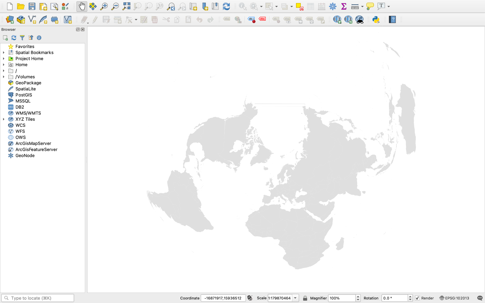

## Tutorial 2.2: Projecting Map and Adding Data

**Summary**

**Tutorial 2.2** demonstrates how to add locational data to QGIS and to project the map (*Figure 2.2-1*).

###### Figure 2.2-1: World map projected as Europe Albers Equal Area Conic

**Using a European Projection**

Open QGIS. Click *New Empty Project*.

Import the *BNDA_simplified.shp* from the Geodatabase. Refer to [**Tutorial 1.5**](/1_Choropleth/1.5_Project_and_Save.md) for more detail.

In the choropleth tutorial, you used the default *Sphere_Eckert_IV* projection, a worldwide projection. However, this map is centered on Europe. Therefore, a worldwide projection is not the best choice.

View the projection options under *Project→Properties…* In the box next to *Filter* type *Europe* and expand *Predefined Coordinate Reference Systems* to see the options for Europe-specific projections.

*Apply* multiple projections to see how they differ. Then, select *Europe_Albers_Equal_Area_Conic* for this project. While equal area projections are required for choropleth maps, they are not required for proportional symbol maps. This is because proportional symbol maps rely on a symbol on top of the geographic area, not the geographic area itself. However, using an equal area projection is still common.

Change the projection for the project and the file, similar to [**Tutorial 1.5**](/1_Choropleth/1.5_Project_and_Save.md). Name the projected shapefile *reprojected_map_europe_albers.shp*.

In QGIS, there can sometimes be issues with reprojecting files. It may look weird at first, but once you zoom in to Europe the file will look normal again.

**Joining CSV Files**

Import the CSV file. 

Join *unid* with *reprojected_map_europe_albers* through the Country Name or ISO code fields.

Refer to [**Tutorial 1.6**](/1_Choropleth/1.6_Add_Data.md) for more detail on joins.

Export this new file with the name *UN_inf_mor_albers.shp* and remove all other layers.

You have now added the location data and projected it properly. Save and proceed to [**Tutorial 2.3**: Extracting European Countries and Centroids](/2_Proportional_Symbol/2.3_select_europe_and_centroids.md).

