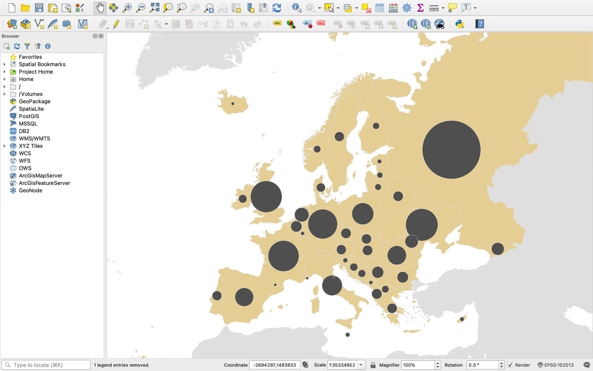

**Tutorial 2.5: Adjusting Style**

**Summary**

**Tutorial 2.5** demonstrates how to change the styling of the map to make certain elements stand out on the visual hierarchy *(Figure 2.5-1)*.

*Figure 2.5-1: Stylized proportional symbol map*

**Improving the Visual Hierarchy**

Change *UN_inf_mor_albers* to a light grey fill with a transparent border.

Change *inf_mor_europe* to a beige fill with a light grey border.

Change *inf_mor_centroid* to a dark grey fill with a white border.

Consult **Tutorial 1.8** and **Tutorial 1.9** as a reminder on how to change these styles.

Compared to the map in the text, the symbols on your map are in different places. Particularly, Russia is much further away from the other countries. This is because you used the "centroid" of the polygons to position the symbols. However, you can move the symbols as needed.

Click on *inf_mor_centroid*. Toggle on editing mode using the yellow pencil. At the top of the screen, click *Edit→Move Feature(s)*. 

Move any of the proportional symbols. Click on them once to select a circle, and a second time to place them. The spot where you click the second time is where the center of the symbol will be placed.

Move the circle for Russia to its western edge, closer to all of the other countries. Norway, Sweden, and Finland would look better if repositioned as well. Use your own discretion to determine which other symbols should be moved. Click the yellow pencil again when finished to save your edits.

You have now added basic stylistic features to your map. Save and proceed to **Tutorial 2.6**: Creating the Legend.

