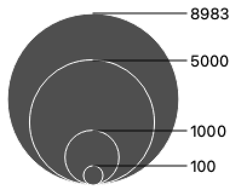

## Tutorial 2.6: Creating the Legend

**Summary**

**Tutorial 2.6** demonstrates how to make the legend *(Figure 2.6-1)*.

Before this lesson, please note that QGIS does not properly display legends in the print layout. The legend appears smaller than reality. GIS software is powerful, but it cannot always do everything you want. Therefore, you can get creative with workarounds!

 

###### Figure 2.6-1: Automated legend for proportional symbol map

**Legend Considerations**

There are a few ways to place the legend. First, after creating it, you can screenshot the legend and insert it next to the map, sizing it yourself.

Second, you can label enough features on the map that your audience can estimate the size of all other features.

Third, if you have other software like Inkscape or Adobe Illustrator, you can design your own legend.

**Designing a Legend**

Begin by screenshotting a legend that you create in QGIS. In the book, the legend is separate from the map. Your legend does not always need to be integrated into the map, as long as it is nearby enough to be usable.

Open *Properties* for *inf_mor_centroid*. Under *Symbology* click *Advanced→Data-defined Size Legend…*

Select *Collapsed legend* where the circles are nested inside each other. This type of legend is common for proportional symbol maps because it saves space.

Click *Manual size classes*. Click the green plus to add circles for *100*, *1000*, *5000*, and *8983*. Note that the maximum value is different from the example in the book because you are using the most recent data, from 2019, while the book uses data from 2016.

Second, although it is common to use round numbers for lower classes, proportional symbols maps often also include the maximum value in the legend, even if it is uneven.

Click *OK* and then click *OK* again. In the layers panel, you can see your legend. It looks nice, but unfortunately does not display properly in the layout view. *Screenshot* the legend to place in the layout later.

**Other Ways to Design a Legend**

Second, instead of placing a screenshot (which may be low quality), you can label some of the features directly. It is good practice to label the lowest value (*Monaco: 1*) and highest value (*Russia: 8983*). Then, label 2-3 intermediate values. Open the attribute table as needed to see the specific values for each country. You can sort the attribute table by clicking on the header of a column to quickly view the lowest and highest values.

You can also use the *Identify Features* tool when in the map view to look at the value for a specific country.

Consult [**Tutorial 1.10**](/1_Choropleth/1.10_Labels.md) if you need a refresher on labeling features.

Third, you could design the legend yourself if you have access to other software like Inkscape or Adobe Illustrator. With one of these programs, you can copy circles from the map and stack them yourself. If you'd like to learn more about this software, there are tutorials online.

The rest of this tutorial will use the first option, a screenshot of the legend.

Now you have learned to make a legend for a proportional symbol map. Save and proceed to [**Tutorial 2.7**: Advanced Layout Styling](/2_Proportional_Symbol/2.7_layout.md).

