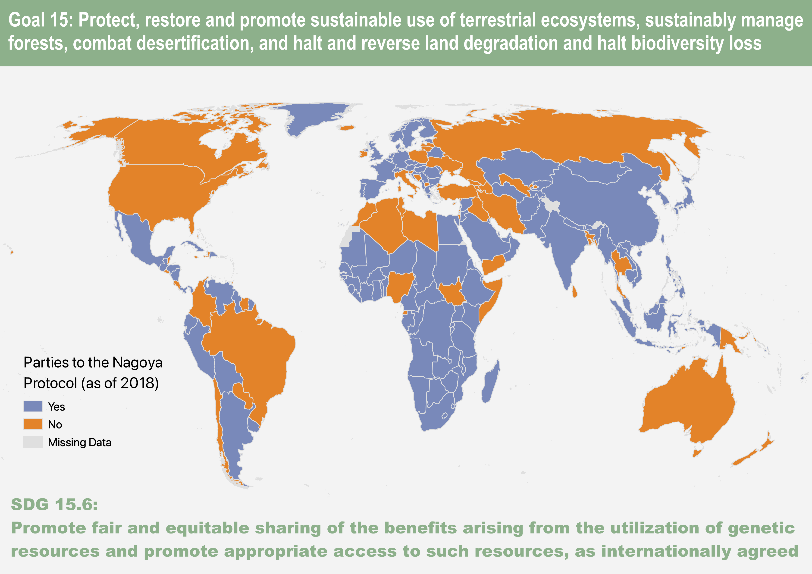

## Tutorial 3.1: Overview and Setup

**Summary**

**Tutorial 3.1** demonstrates how to make the ***nominal map*** on page 60, which displays SDG Indicator 15.6.1: "Countries that are parties to the Nagoya Protocol" *(Figure 3.1-1)*.

> ***Nominal map***: a thematic map that depicts categorical data and thus relies on unordered visual variables (see **Section 3.2**)

This is the third in a set of tutorials paired with *Mapping for a Sustainable World*. The first tutorial teaches you how to create a choropleth map. The second teaches you how to create a proportional symbol map. Completion of the previous tutorials is not required to complete the nominal map tutorial. However, the choropleth tutorial is a specific, step-by-step tutorial. The nominal map tutorial is less specific and asks you to refer to the previous tutorial for a "how to", rather than describing each step in absolute detail.

###### Figure 3.1-1: Nominal map of SDG 15.6.1, from page 60-61 of *Mapping for a Sustainable World*.

**Tutorial 3.1** covers the same instructions as **Tutorials 1.1** through **1.6**

**Scope**

Before beginning the map creation process, always consider the scope of your project. This includes: 

* Define the Project Goals
* Review Available Datasets
* Clean and Reformat Data
* Transform and Analyze the Data for Insights
* Execute the Map Design
* Evaluate and Edit the Map Design

Refer to [**Tutorial 1.1**](/1_Choropleth/1.1_Scope.md) or **Section 2.2** of the *Mapping for a Sustainable World* book for more detail.

**Download QGIS**

If this is your first time using QGIS, refer to [**Tutorial 1.2**](/1_Choropleth/1.2_Download_QGIS.md) to download it.

**Download Attribute and Location Data**

On your computer, create a project folder called *SDG_nominal_tutorial*. 

Follow [**Tutorial 1.3**](/1_Choropleth/1.3_Download_Data.md) to download the data. Every step is the same, except this time you will be downloading SDG Indicator 15.6.1 *Countries that are parties to the Nagoya Protocol (1 = YES; 0 = NO)*. 

**Clean Attribute Data**

Resave the *ER_CBD_NAGOYA.xlsx* file as *Cou_Nag_Pro.xlsx*. Open the new file and convert the 2012 column (the most complete) to numeric. Rename this column *Nagoya*. 

Scroll through the data. There are a few countries where the number (0 or 1) is in the column for a different year. For these countries, copy that number to the *Nagoya* column. You do not need to copy the numbers larger than 1 (these represent world regions, not individual countries).

When the data is cleaned, export this file as a CSV called *unnp.csv* and export *Comtrade Country Code and ISO list.xlsx* as a CSV called *cc.csv*.

Refer to [**Tutorial 1.4**](/1_Choropleth/1.4_Clean_Data.md) for more detail on how to complete these steps.

**Project and Save**

Open QGIS and add your shapefile and two CSV files. Like the choropleth tutorial, use the world projection *Sphere_Eckert_IV* for this data. Remember to change the projection for the shapefile and the project. 

Save your QGIS file as *SDG_nominal_tutorial_map*

Refer to [**Tutorial 1.5**](/1_Choropleth/1.5_Project_and_Save.md) for more detail on how to complete these steps.

**Join Data**

With all three files in QGIS, join the layers. Using the appropriate fields, join *cc* and *unnp* first, and then export this file as *unnpcc.csv*. Join this new file with your shapefile. Export this file as well to make your joins permanent. 

Refer to [**Tutorial 1.6**](/1_Choropleth/1.6_Add_Data.md) for more detail on how to complete these steps.

Save and proceed to [**Tutorial 3.2**: Selecting and Styling Data](/3_Nominal/3.2_select_and_style.md).

