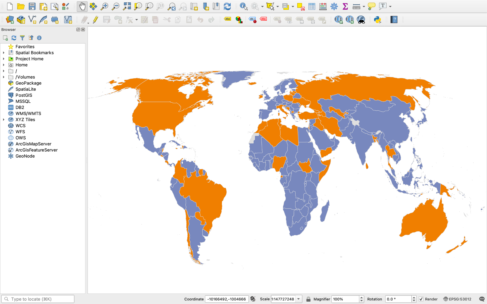

## Tutorial 3.2: Selecting and Styling Data

**Summary**

**Tutorial 3.2** demonstrates how to export and style individual layers *(Figure 3.2-1)*.

###### Figure 3.2-1: Nominal map after initial styling

**Selecting Data for a Nominal Map**

With the files joined, it is time to select the data. There are three categories in this nominal map: *yes*, *no*, and *missing data*.

Open the attribute table. Use *Select features using an expression* to write the expression *"Nagoya" = 0*. *Save Selected Features As…* to create a new layer called *nagoya_no.shp*.

Repeat this process for *"Nagoya" = 1*, naming this layer *nagoya_yes.shp*.

**Setting a Qualitative Colour Scheme**

Next, select the colour scheme for this map. In the choropleth map, you used a sequential colour scheme. A lighter colour value represented lower numerical value, while darker colour value represented higher numerical value. 

In your nominal map, you used a quantitative colour scheme. Qualitative colour schemes use colours of equal colour value so one is not emphasized over the other. For example, if you wanted to show the location of three different species of trees, but all were equally important, you would use a nominal colour scheme.

Use a slightly saturated orange to represent *no* and a slightly desaturated blue to represent *yes*. This is still a qualitative colour scheme. However, a more saturated colour is used for the *no* category, emphasizing countries that have yet to ratify the protocol in the binary nominal map. Use a light grey border for both.

A third type of colour scheme is called diverging. It is similar to the sequential colour scheme, but with two directions. Therefore, the middle point must be meaningful.

Refer to **Section 2.10** of the *Mapping for a Sustainable World* book to compare colour schemes side by side.

Use light grey to represent missing data. Style all of the countries in your original shapefile with both a light grey fill and light grey line. If this layer is in the back (below the other two layers), then only the countries with missing data will appear grey.

Consult [**Tutorial 1.8**](/1_Choropleth/1.8_Classify_Data.md) and [**Tutorial 1.9**](/1_Choropleth/1.9_Visual_Accenting.md) as a reminder on how to change these styles.

You have now learned how to style the different layers. Save and proceed to [**Tutorial 3.3**: Advanced Styling](/3_Nominal/3.3_layout.md).

